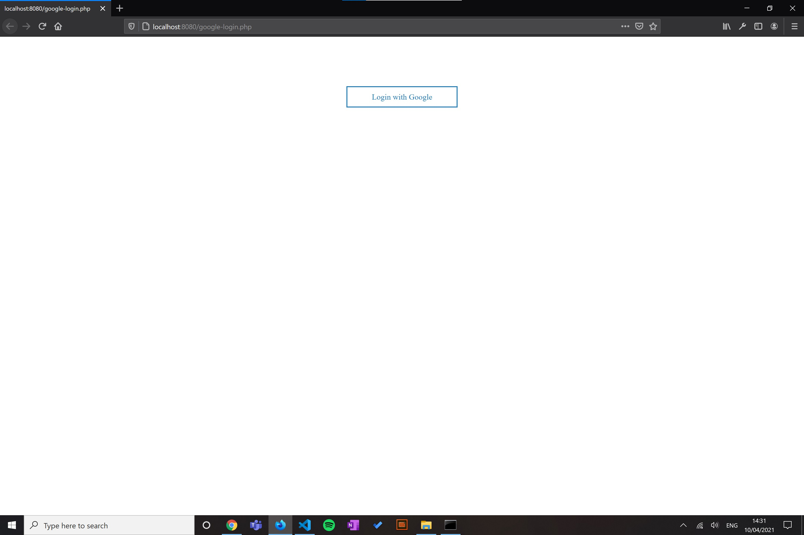
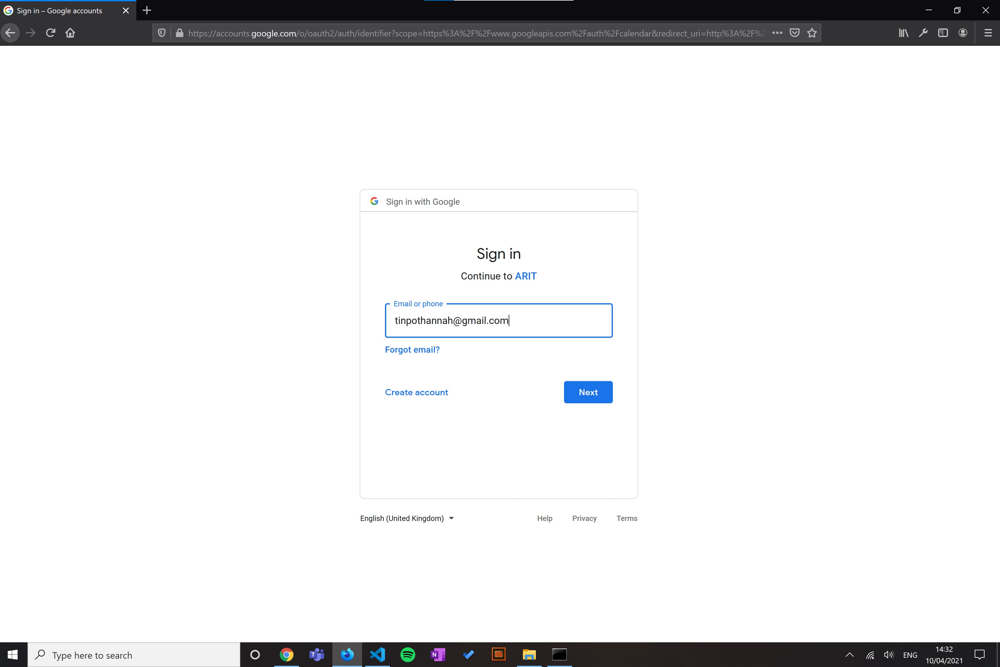
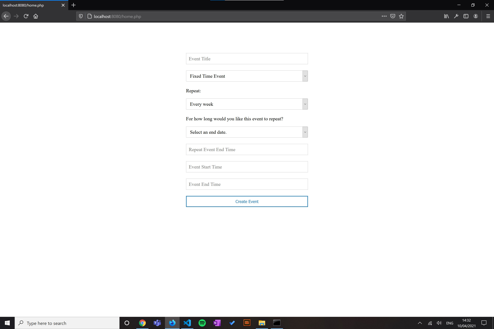
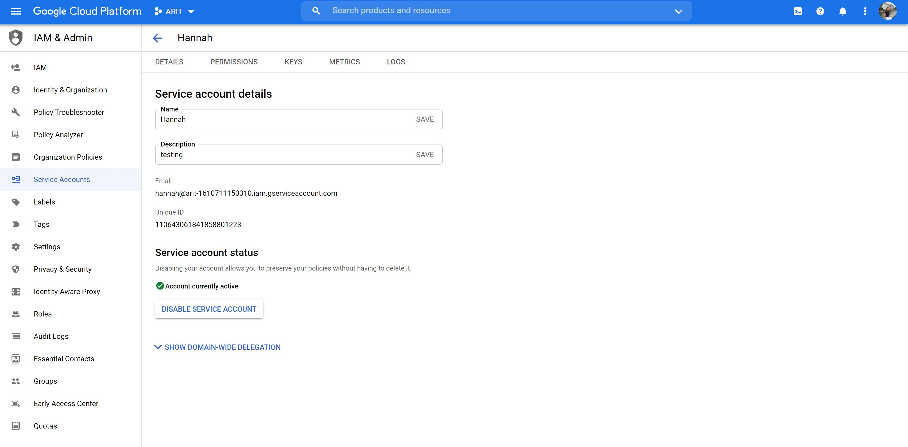

# Google Calendar feature for _A Room In Town_

Thank you to https://usefulangle.com/post/58/google-calendar-api-create-update-delete-event-php for the tutorial that this web-app is based on.

This is a fairly basic web-app that can perform the following functions:
- Create/ update or delete an event.
- Set the event to all-day or between certain times.
- Be able to create an event that repeats weekly.
- The event can repeat indefinitely or until a certain date.

 <nobr>

 <nobr>

 <nobr>

## Setup

1. Start a PHP server and direct to http://localhost:8080/home.php in your chosen browser.
2. User is asked to login to their Google account.
3. If the OAuth process is successful, the user can create, update or delete events.

## Using a service account

In the API setup on the Google Cloud Platform, I set my account to be a service account. This means during testing, Google does not prompt for access to my account every time.

## The access token

Google’s access tokens are short-lived (according to a programmer on Stack Overflow, the expiration time is around 1 hour (1)). However, after completion of the OAuth2 flow, you will receive a refresh token that never expires. Limits apply to the number of refresh tokens that are issued per client-user combination, and per user across all clients (2). These can then be used to get access tokens on-demand. 

**References**  

1. security - OAuth2 and Google API: access token expiration time?. [Online] Stack Overflow. Available from: https://stackoverflow.com/questions/13851157/oauth2-and-google-api-access-token-expiration-time [Accessed: 10th April 2021]
2. Using OAuth 2.0 to Access Google APIs | Google Identity. [Online] Google Developers. Available from: https://developers.google.com/identity/protocols/oauth2 [Accessed: 10th April 2021]

## .gitignore

For security reasons, the client ID, client secret and redirect URL are stored in a file called _settings.php_ which is hidden using .gitignore .

## ARIT's calendars

1. Room bookings calendar (therapists book rooms as a one-off or recurring) - Need to sync from ARIT to therapist’s own Google calendar.
2. Therapists slots calendar (patients or other clients book slots for a single therapist) - Need to sync fro ARIT to patient’s own Google calendar.

## Random notes

The calendar where the event is created is the organizer calendar. In this case, this is ARIT’s calendar.  

The therapist can be added to the event as an attendee.  

We can allow customers (the therapists) the right to see when rooms are free or busy but not the details of events. This is done using the freeBusy.query operation.  

In England we use BST.  

The API key is a unique identifier that authenticates requests associated with your project for usage and billing purposes.  
